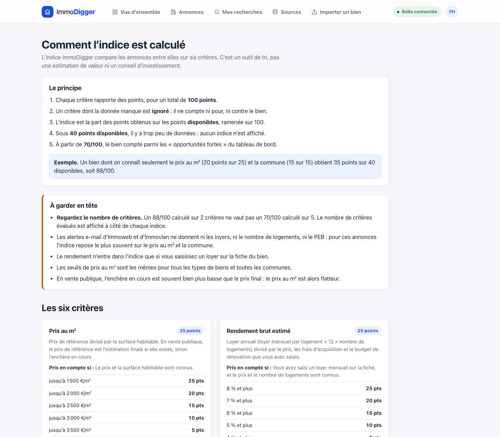

# ImmoDigger

A personal real-estate radar for Belgian investment property. ImmoDigger gathers
listings from several sources into one place, removes duplicates, tracks price
changes, flags what needs checking and ranks every property with a transparent
comparison index.


## Why

Looking for an income property in Belgium means following half a dozen portals,
public-sale platforms and institutional sellers, each with its own alerts and
its own way of describing a building. The same property shows up several times,
price drops go unnoticed, and the details that decide an investment (number of
recognised units, planning infractions, time on the market) are buried in free
text.

ImmoDigger turns that into a single, comparable list.

## Features

- **Multi-source collection** on a schedule: portal alert emails (Immoweb,
  Immovlan, Zimmo, 2ememain, Spotto, Immoscoop, Realo, agencies), public
  APIs and pages (Biddit, Régie des Bâtiments, bpost immo, Proximus Real
  Estate) and one-off import by URL.
- **Deduplication** on five levels, from source identifier to content hash,
  including the same property advertised on two portals.
- **Comparison index out of 100** built from six criteria, with the number of
  criteria actually evaluated shown next to every score.
- **Vigilance signals** read from the listing text in French and Dutch:
  planning infractions, units not officially recognised, non-compliant
  electrics, occupied property, missing price.
- **Official documents** for public sales: the planning and cadastre PDFs
  published with a Biddit lot are read to find the recognised unit count.
- **Time on the market** highlighted once a listing has been online for two
  months, and again after four.
- **Price history**, personal notes, rent and renovation assumptions, and a
  gross-yield estimate per listing.
- **Saved search profiles** that open the matching listings in one click.
- **Responsive interface**, from phone to wide desktop.

| Listings | Listing detail |
| --- | --- |
|  |  |

## How the index works

Each criterion is worth a fixed number of points. A criterion whose data is
missing is ignored rather than counted against the property, and the index is
the share of points earned out of the points available, scaled to 100. Below
40 available points no index is shown at all.

| Criterion | Points | Based on |
| --- | --- | --- |
| Price per m² | 25 | Reference price divided by living area |
| Estimated gross yield | 25 | Rent entered by the user, price and costs |
| Number of units | 15 | Units described in the listing or official documents |
| Location | 15 | A fixed three-tier ranking of Brussels communes |
| Energy performance | 10 | PEB / EPC rating |
| Vigilance | 10 | Risk level derived from the signals above |

The scales live in one place in the code. The in-app page explaining the index
is generated from those same values through the API, so the explanation cannot
drift from the calculation.



## Architecture

```text
ImmoDigger/
  backend/
    ImmoDigger.Domain/          entities and business rules
    ImmoDigger.Application/     use cases, DTOs, interfaces, validation
    ImmoDigger.Infrastructure/  PostgreSQL, collectors, IMAP, imports
    ImmoDigger.Api/             controllers and HTTP start-up
    ImmoDigger.Tests/           xUnit tests
  frontend/                     React, TypeScript, Vite, nginx
  compose.yaml                  PostgreSQL + API + frontend
  compose.prod.yaml             HTTPS and mandatory login on top
```

The backend follows a simplified Clean Architecture: `Api` → `Infrastructure`
→ `Application` → `Domain`. EF Core migrations are applied when the API
starts.

```text
Alert emails ─┐
Public APIs  ─┼─► Collectors ─► Deduplication ─► Price history ─► Analysis ─► API ─► React
URL import   ─┘
```

| Layer | Stack |
| --- | --- |
| API | .NET 10, ASP.NET Core, EF Core, FluentValidation |
| Data | PostgreSQL 17 |
| Collection | MailKit (IMAP), HtmlAgilityPack, PdfPig |
| Frontend | React 19, TypeScript, Vite, TanStack Query, React Router |
| Delivery | Docker Compose, nginx, Caddy |
| Tests | xUnit, EF Core InMemory |

### Collecting without scraping

ImmoDigger does not bypass CAPTCHAs, logins or anti-bot protection. Portals
that forbid automated access are only ever read through the alert emails they
send to the user's own mailbox. Every source carries a collection method and
an `Allowed` flag that is independent of whether the user enabled it, and the
collection service refuses to run a source that is not allowed.

Importing by URL reads a single page requested by the user, and only its
preview metadata. The server rejects local and private addresses, does not
follow redirects and caps the download size, so it cannot be used as a relay
into an internal network.

## Getting started

Requires Docker with Compose.

```bash
cp .env.example .env
docker compose up --build -d
```

Open <http://localhost:5173>. Demo mode is on by default and seeds fictional
listings, so every screen can be tried without connecting a source.

To collect real alerts, set the `IMAP_*` variables in `.env` to a mailbox that
receives your saved-search emails, restart the API, then use **Sources → Lancer
une collecte maintenant**. Use an application password where the provider
offers one.

## Development

Requires the .NET 10 SDK, PostgreSQL and Node.js 22.

```bash
# Backend
cd backend
dotnet test ImmoDigger.slnx
dotnet run --project ImmoDigger.Api --launch-profile http

# Frontend
cd frontend
npm ci
npm run dev
```

The connection string is read from user secrets or the environment:

```bash
dotnet user-secrets --project ImmoDigger.Api set \
  "ConnectionStrings:Postgres" \
  "Host=localhost;Port=5432;Database=immodigger;Username=immodigger;Password=..."
```

The OpenAPI document is served at `/openapi/v1.json` in the Development
environment.

## Deployment

`compose.yaml` only listens on the local machine. The production overlay adds
automatic HTTPS and refuses to start without a login:

```bash
docker compose -f compose.yaml -f compose.prod.yaml up --build -d
```

| Variable | Purpose |
| --- | --- |
| `DOMAIN` | Host name pointing at the server; its certificate is obtained automatically |
| `APP_USERS` | Full-access accounts, as `name:password,name2:password2` |
| `APP_READONLY_USERS` | Optional accounts that can browse but not change anything |
| `POSTGRES_PASSWORD` | Database password |
| `DEMO_MODE` | Set to `false` to stop seeding fictional listings |

The API is never published directly: it is only reachable through the
frontend's reverse proxy, behind the login.

## Limitations

- Alert emails carry a title, a price and a surface, not the full description.
  For those listings the index usually rests on two criteria out of six.
- The location criterion covers a handful of Brussels communes with a fixed
  ranking; it is not market data.
- All accounts share the same data: there are no per-user workspaces.
- The interface is in French.
