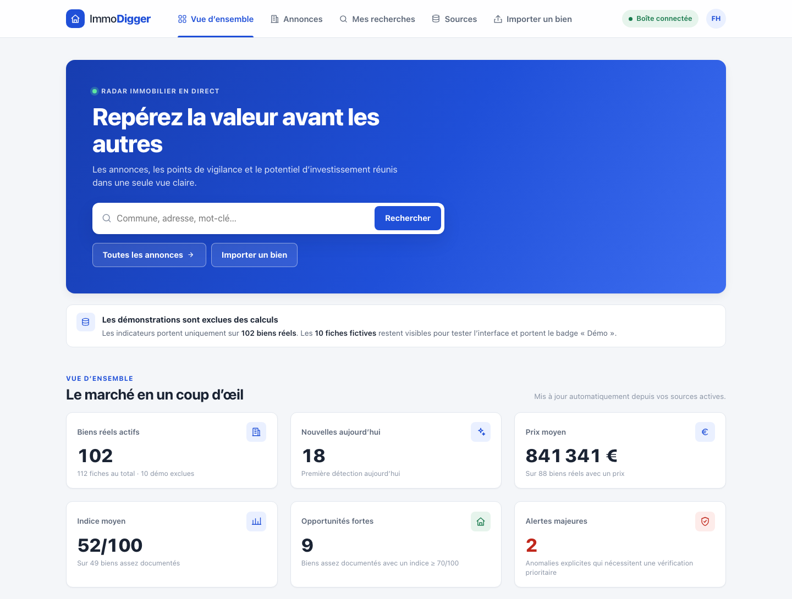
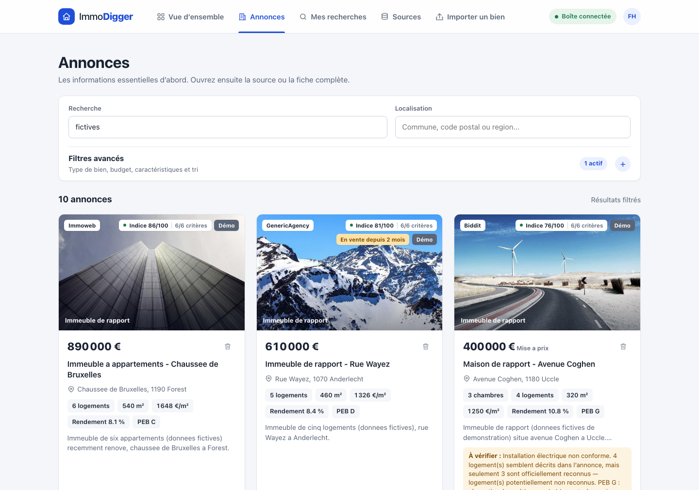
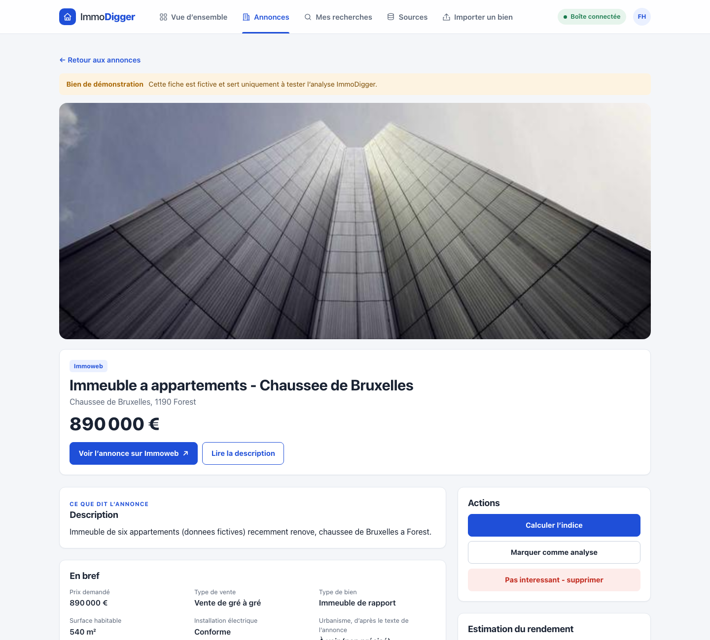

# ImmoDigger

Real-estate watch tool I built to follow income properties for sale around
Brussels. It pulls listings from several sources into one list, removes
duplicates, keeps the price history and scores each property.



## Features

- Scheduled collection from portal alert emails (Immoweb, Immovlan, Zimmo…),
  Biddit and a few institutional sellers, plus import by URL
- Deduplication, including the same property listed on two portals
- Index out of 100 on six criteria, with the number of criteria actually known
- Warnings read from the listing text (FR/NL): planning infractions,
  unrecognised units, non-compliant electrics
- Time on the market, price history, notes and gross-yield estimate
- Saved searches, filters shareable by URL, responsive UI

| Listings | Detail |
| --- | --- |
|  |  |

## Stack

| | |
| --- | --- |
| Backend | .NET 10, ASP.NET Core, EF Core, PostgreSQL |
| Frontend | React 19, TypeScript, Vite, TanStack Query |
| Collection | MailKit (IMAP), HtmlAgilityPack, PdfPig |
| Delivery | Docker Compose, nginx, Caddy |
| Tests | xUnit |

```text
backend/
  ImmoDigger.Domain/          entities and rules
  ImmoDigger.Application/     use cases, DTOs, interfaces
  ImmoDigger.Infrastructure/  database, collectors, IMAP
  ImmoDigger.Api/             controllers
  ImmoDigger.Tests/
frontend/                     React app served by nginx
```

## Run

```bash
cp .env.example .env
docker compose up --build -d
```

Then open <http://localhost:5173>. Demo mode is on by default, so the app is
usable without connecting a mailbox. To collect real alerts, fill in the
`IMAP_*` variables in `.env`.

Without Docker:

```bash
cd backend && dotnet test ImmoDigger.slnx && dotnet run --project ImmoDigger.Api
cd frontend && npm ci && npm run dev
```

## Deploy

```bash
docker compose -f compose.yaml -f compose.prod.yaml up --build -d
```

The production overlay adds HTTPS and requires a login. Set `DOMAIN`,
`APP_USERS` (`name:password,…`) and `POSTGRES_PASSWORD` in `.env`.
`APP_READONLY_USERS` adds accounts that can browse but not change anything.

## Index

| Criterion | Points |
| --- | --- |
| Price per m² | 25 |
| Estimated gross yield | 25 |
| Number of units | 15 |
| Location | 15 |
| Energy rating | 10 |
| Warnings | 10 |

A criterion with no data is skipped, and the score is the points earned over
the points available. The full scale is shown in the app, generated from the
same values the code scores with.

## Notes

- Portals that forbid scraping are only read through the alert emails they
  send; nothing bypasses a login or anti-bot protection.
- Alert emails are short, so many listings are scored on two criteria only.
- The interface is in French.
